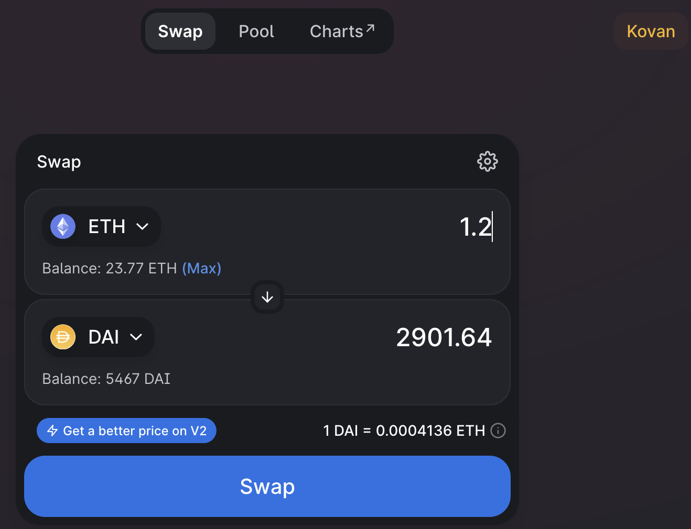
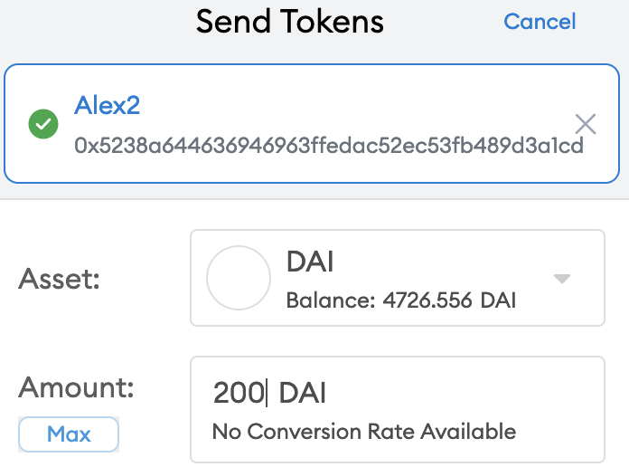
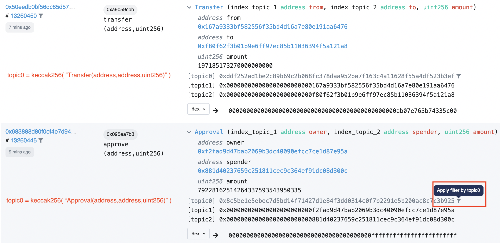
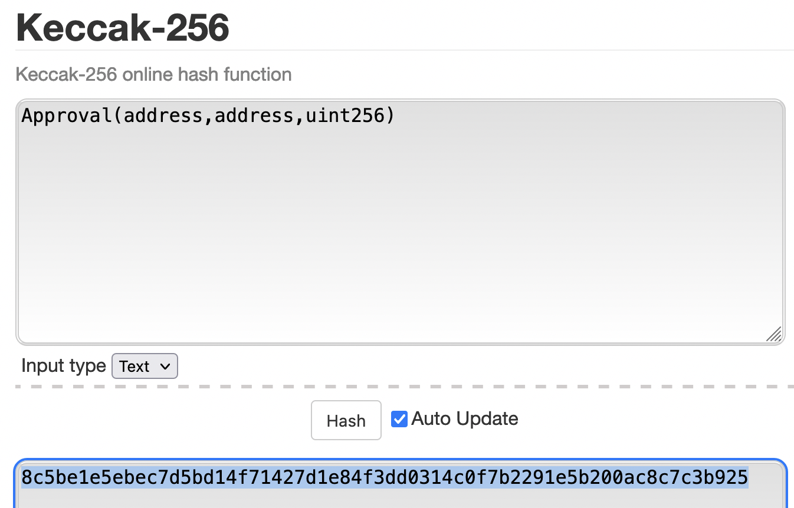
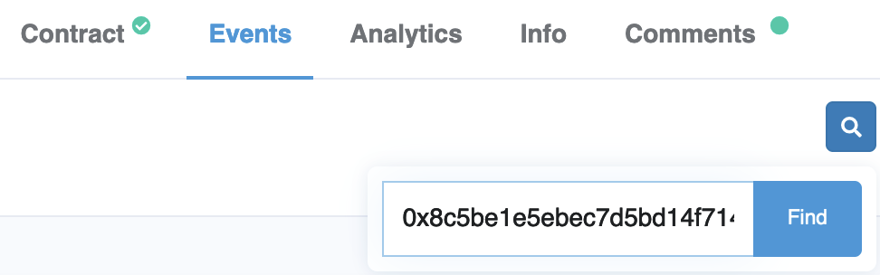
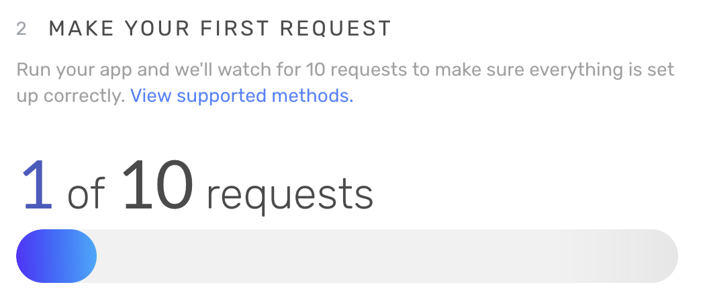

# Warming Up

Before diving into coding, let's have some fun with existing blockchain tools and products first to get a feel of "using blockchain apps".

First, set up your [MetaMask wallet](https://metamask.io/index.html). For more information, read its [FAQ](https://metamask.io/faqs.html) page.

> Available as a browser extension and as a mobile app, MetaMask equips you with a key vault, secure login, token wallet, and token exchange—everything you need to manage your digital assets.

Explore inside the intuitive MetaMask wallet, and try to accomplish the following by clicking around:

- Switch to a different network (e.g. switch to Rinkeby testnet).
- Create a new account.
- Change your account name/alias from "Account X" to something you prefer.
- Copy paste your public address (e.g. `0x5238...a1CD`).
- View your _Secret Recovery Phrase_ (but never ever reveal to others or even let it stay in your clipboard for too long, this is your master secret seed).
- View your account on Etherscan.

Now you are ready to try out the following:

- [Sending and receiving ethers](#sending-and-receiving-ethers)
- [Exploring blockchain explorer: etherscan](#blockchain-explorer-etherscan)
- [Play with ERC20 tokens](#play-with-erc20-tokens)
- [Play with ERC721 tokens](#play-with-erc721-tokens)
- [Setup alchemy account](#setup-alchemy)

## Sending and receiving ethers

Your wallet and accounts will very likely have 0 ether in balance when you create them. To play round sending Ethers, we need some in our wallet first.
There are usually two primary ways to get ethers on Ethereum mainnet -- a) via over-the-counter (OTC) trade/purchase where you meet up with a friend whom send some ethers
to your address upon receiving cash or equivalent in real life; b) via centralized exchanges (CEX) such as [Coinbase](https://coinbase.com), [Binance SG](https://binance.sg), [Gemini](https://www.gemini.com/apac/singapore), etc., where you deposit SGD / USD via bank transfer, exchange it for cryptocurrencies of your choice which you can then
move out to your wallet.

For experimentation purposes, we use "fake ethers" on testnets only.
Testnets are identical to mainnet except that:

- it's not running expensive decentralized consensus like PoW or PoS, but usually only maintained by a handful of nodes -- known as "Proof of Authority" (PoA) consensus.
- all money (ethers, tokens) on testnet has no real world value.
- testnets are meant for testing in a simulated, (almost) identical environment as mainnet before developers ship products to live mainnet -- "almost" especially referring to the lack of cryptoeconomic environment (e.g. it's hard to validate staking-based attack vectors or the lack thereof in testnets).

Now switch to a testnet, and web search "xxx testnet faucet" which is the "cash printer" for anyone who wants free "fake ethers".
In the case of Rinkeby testnet, enter your receiver address to [this faucet](https://faucet.rinkeby.io/).
Please note that all testnets typically implement rate limiting (at most request X test ether in Y hours) to prevent DoS attack.

While you are waiting for the faucet(s) to grant you test ethers, here's a fun question to ponder on: "What are the rare cases where you create a new account to find positive balance?":

 
Think hard about it before revealing the answers!

- your private key collides with someone else's: there are [~170 million](https://etherscan.io/chart/address) total distinct addresses on Ethereum
  as of Sept 13, 2021 according to Etherscan. The private key of an ethereum wallet is 256 bit long, which gives us 2^256 total possibilities. Your chance of a randomly sampled an in-use private key is < 2^(28-256) = 2^(-228). FYI, there are roughly 2^224 atoms in our galaxy. In short, it's extremely unlikely to happen.
- someone accidentally sends your address some ethers. (mistype the receiver address)
- on the topic of receiving money unknowingly, can you force a contract to receive ether even if it doesn't have `receive() external payable {...}` function?
  The answer is yes, via `selfdestruct`, [read doc here](https://docs.soliditylang.org/en/latest/contracts.html?highlight=selfdestruct#receive-ether-function).

Let's go back to your wallet and off you go, try to send your friends or another wallet of your own some ethers!

Click on any transaction you've sent and take a look at its details. Here are a few noteworthy points:

- **nonce** is a counter keep track of the total number of outgoing transactions you've sent (including failed ones, but excluding receiving ones). This is partially used as a prevention mechanism for _replay attacks_ where a malicious node takes a historical transaction you've signed and replay it -- this attack won't work because each transaction you authorize is specific to a unique, incremental nonce.
- **base fee v.s. priority fee** are concepts introduced in [EIP 1559](https://eips.ethereum.org/EIPS/eip-1559). You only have to know "total fee = base fee + priority fee" and can safely ignore the rest for now. (For inquisitive minds, we recommend reading ["Why 1559" by Tim Beiko](https://hackmd.io/@timbeiko/1559-updates/https%3A%2F%2Fhackmd.io%2F%40timbeiko%2Fwhy-1559) or watching this [explainer video by Finematics](https://www.youtube.com/watch?v=MGemhK9t44Q))
- **gwei** is a unit, just like the basic denomination _wei_. As explained [here](https://docs.soliditylang.org/en/latest/units-and-global-variables.html?highlight=gwei#ether-units), 1 gwei= 10^9 wei.
- Try to calculate the total ether paid for the example transaction above: `1 ether + 21000 * (1.99..93 + 0.00..07) gwei= 1 ether + 21,000 * 2 * 10^9 gwei= 1 + 4.2 * 10 ^ (9-18+4) ether`

## Blockchain explorer: Etherscan

Go to the most popular block explorer [etherscan.io](https://etherscan.io/), and try out the following:

- Find your address (if you find there's no activity there, it's because you're viewing your address on live mainnet, try switch to [Rinkeby Explorer](https://rinkeby.etherscan.io/)) and click into some transactions your accounts are involved with and read their details.
- Search `vitalik.eth` on mainnet, see how much ethers is in one of Vitalik's many accounts.
  - `.eth` is [Ethereum Name Service](https://ens.domains/) (ENS) domain registry similar to our ".com" or ".sg" in web2 world.
  - take a look at Vitalik's token possession (both ERC20 and ERC721).
- Search `Uniswap` contract, a decentralized exchange (DEX)
  - Go to the contract address (hint: `0x1f9..984`), read the verified code
  - Click on any transaction under this DEX, see if you can figure out what this transaction is roughly doing from "Log", "Overview" etc.
- Search a transaction `0x47f7cff7a5e671884629c93b368cb18f58a993f4b19c2a53a8662e3f1482f690`
  - this is the infamous Parity "Self-destruct" Hack in 2017 that locked more than 510k ETH, ([postmortem](https://www.parity.io/blog/a-postmortem-on-the-parity-multi-sig-library-self-destruct/), and ["I accidentally killed it" github thread](https://github.com/openethereum/parity-ethereum/issues/6995))
- Search a block with height `1920000`, although you don't see many transactions in it, this is officially the [DAO fork](https://blog.ethereum.org/2016/07/20/hard-fork-completed/) block.
- Find out the histogram of Ethereum network hash rate, meanwhile, click around to find more statistics.

## Play with ERC20 tokens

Assume that you have some Rinkeby test ETH in your wallet. Head to [Uniswap](https://app.uniswap.org/#/swap) and swap your ETH with some other ERC20 tokens
such as [DAI](https://coinmarketcap.com/currencies/multi-collateral-dai/) (algorithmic stable coin), [UNI](https://uniswap.org/blog/uni/) (Uniswap protocol token),
[USDC](https://www.centre.io/usdc) (custodian, reserve backed stable coin) etc.

 

Then try to:

- "Add Token" in your MetaMask wallet so that you can see your ERC20 asset balances.
- Send your ERC20 token to another address.
- View your ERC2 related transactions on Etherscan, click on their details.

### More tips on Etherscan

Go to [Uniswap contract on Etherscan](https://etherscan.io/address/0x1f9840a85d5af5bf1d1762f925bdaddc4201f984):

- Under "Transactions" tab, you should see list of transactions directed at this contract, including the method/function invoked, its block height, its sender and receiver, and the amount of Ether transferred along with the transactions.
  View any of those _completed_ transactions (instead of pending ones), see their "Logs" and "State" changes to get a rough idea of what this transaction does.
- Under "Erc20 Token Txns" tab, you should see a list of ERC20 transfer to the contracts.
- Under "Contract" tab, you should be able to read the verified contract.
  Click on "Read Contract" sub-tab, you can even directly query read-only, gas-free functions inside the contract (learn more about ["transaction v.s. call"](https://ethereum.stackexchange.com/questions/765/what-is-the-difference-between-a-transaction-and-a-call)).
  Click on "Write Contract", you can send invoke those state-changing functions after connecting your wallet (we don't need to do it as it cost real Ether).
- Under "Events" tab, you can view all emitted events under the contract address, here's how you could search specific event by either Block number or their topic hash. We emphasize on ways to find out the topic identifiers.
  - `topic0` is the Event signature -- the keccak256 hash of the event type (with blank spaces removed and input parameter names removed). You can click on the "filter icon" to narrow dow the event logs to only that particular type.
    
  - alternatively, you can go to [this website](https://emn178.github.io/online-tools/keccak_256.html) and paste the Event signature over to get its hash digest, finally prepend the hash value with `0x` and paste it in the search box.
     

## Play with ERC721 tokens

Go to [OpenSea](https://testnets.opensea.io/) and explore around, you can even considering uploading and selling your own NFTs (if you don't mind paying for the high transaction fee).

You could also check out [Dapper Labs'](https://www.dapperlabs.com/#products) products such as NBA Top Shot and Cryptokitties.

### More tips on Etherscan

One of the most popular NFT project is [CryptoPunks](https://www.larvalabs.com/cryptopunks), and you can find the ERC721 Contract on [here](https://etherscan.io/address/0xb47e3cd837ddf8e4c57f05d70ab865de6e193bbb).

You can find some avid collectors just by inspecting the transactions.
For example, you can see someone spend 106 ETH on one of those avatars, see the transaction detail [here](https://etherscan.io/tx/0xad6a7e76c562d0c2d5075f1eed6b5afc6c7d1c286d2902773bd78c014701e8ff).
See if you can find the `punkIndex` of the NFT being bought in this transaction.
Finally go to OpenSea, search "CryptoPunks", then put the `punkIndex` into the search bar, you should be able to see [this page](https://opensea.io/collection/cryptopunks?collectionSlug=cryptopunks&search[query]=9059&search[sortAscending]=true&search[sortBy]=PRICE) showcasing more details.

## Setup alchemy

[Alchemy](https://www.alchemy.com/) is a powerful developer tool providing features like hosted Ethereum nodes with API access. What that means is: you don't have to run
your own Ethereum node in order to receive updates from or deploy your contacts to the live network. Instead, you use Alchemy Supernode service as a gateway for highly
available nodes with a rich set of APIs for your applications to interact with the blockchain.

You can [register here](https://auth.alchemyapi.io/signup), and go through their ['getting started'](https://docs.alchemy.com/alchemy/introduction/getting-started) doc here.

Give your project whatever name you prefer, and try to compartmentalize your backend traffic analytic from that of the front-end by creating separate projects --
for now, let's just create one to experiment with, "Environment" set to "Development", "Network" selected as "Rinkeby" (you can switch to others later).

Once you have logged in, you should be able to see your dashboard and a task of "Make your first request". We encourage you to view the list of supported methods and
make requests from your command line as instructed.

In case if you are an automation maximalist, and prefer running a script over manually sending 10 requests, try the following:

- Rename `.env.example` file to `.env`in our project root (don't worry, it's git ignored)
- Copy paste your own HTTP integration API key into the `.env` file
- Run [`./scripts/alchemy-requests-example.sh -n rinkeby`](./scripts/alchemy-requests-example.sh) in your command line

We further note that there are alternatives like [Infura](https://infura.io/) that offers similar services, you can use either for your own projects, but we use Alchemy as the default provider in our workshop.
