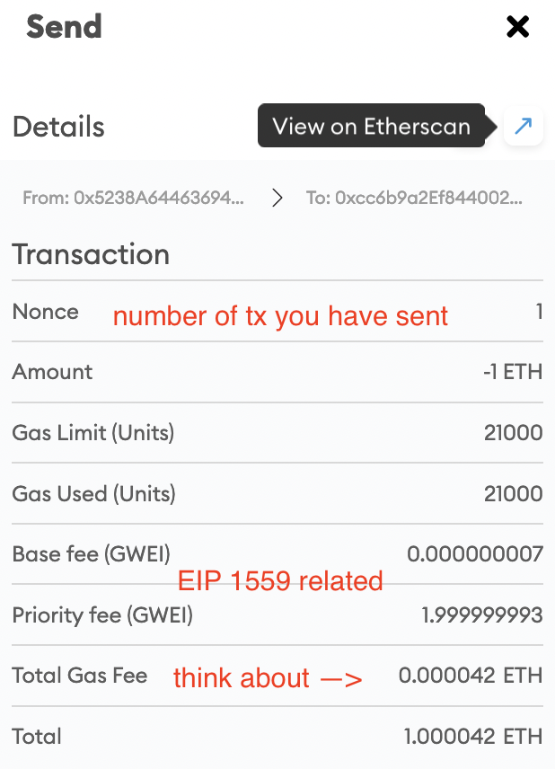
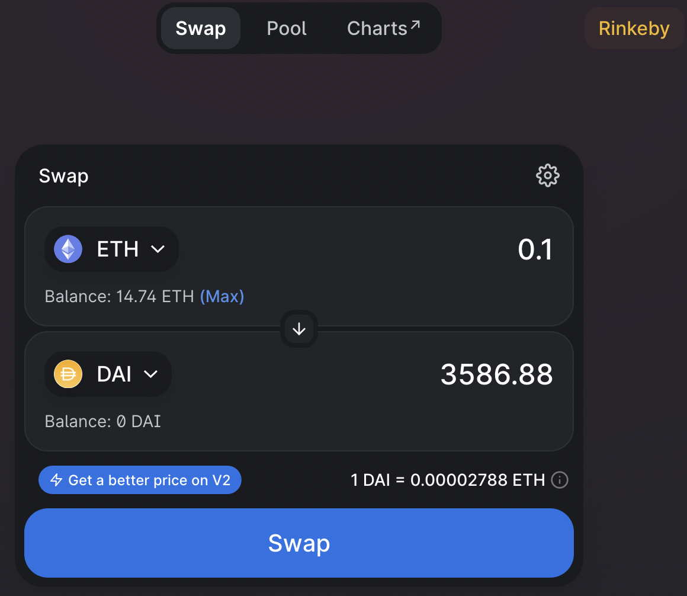

# Warming Up

Before diving into coding, let's have some fun with existing blockchain tools and products first to get a feeling of "using blockchain apps".

First, set up your [MetaMask wallet](https://metamask.io/index.html). For more information, read its [FAQ](https://metamask.io/faqs.html) page.

> Available as a browser extension and as a mobile app, MetaMask equips you with a key vault, secure login, token wallet, and token exchange—everything you need to manage your digital assets.

Explore inside the intuitive MetaMask wallet, and try to accomplish the following by clicking around:

- Switch to a different network (e.g. switch to Kovan testnet).
- Create a new account.
- Change your account name/alias from "Account X" to something you prefer.
- Copy paste your public address (e.g. `0x5238...a1CD`).
- View your _Secret Recovery Phrase_ (but never ever reveal to others or even let it stay in your clipboard for too long, this is your master secret seed).
- View your account on Etherscan.

Now you are ready to try out the following:

- [Sending and receiving ethers](#sending-and-receiving-ethers)
- [exploring blockchain explorer: etherscan](#blockchain-explorer-etherscan)
- [play around ERC20 tokens](#play-around-erc20-tokens)
- [play around ERC721 tokens](#play-around-erc721-tokens)
- [setup alchemy account](#setup-alchemy)

## Sending and receiving ethers

Unless unlikely events, your wallet and accounts should have 0 ether in balance when you created them. To play round sending Ethers, we need some in our wallet first.
There are usually two primary ways to get ethers on Ethereum mainnet -- a) via over-the-counter (OTC) trade/purchase where you meet up with a friend whom send some ethers
to your address upon receiving cash or equivalent in real life; b) via centralized exchanges (CEX) such as [Coinbase](https://coinbase.com), [Binance](https://binance.com), [Gemini](https://www.gemini.com/apac/singapore), etc., where you deposit via bank transfer and CEX would credit you cryptocurrencies of your choice which you can further
move those assets out to your self-hosted wallet like MetaMask.

For our experimentation purposes, we use "fake ethers" on testnets only.
Testnets are identical to mainnet except that:

- it's not running expensive decentralized consensus like PoW or PoS, but usually only maintained by a handful of nodes -- known as "Proof of Authority" (PoA) consensus.
- all money (ethers, tokens) on testnet has no real world value.
- testnets are meant for testing in a simulated, (almost) identical environment as mainnet before developers ship products to live mainnet -- "almost" especially referring to the lack of cryptoeconomic environment (e.g. it's hard to validate staking-based attack vectors or the lack thereof in testnets).

Now switch to a testnet, and web search "xxx testnet faucet" which is the "cash printer" for anyone who wants free "fake ethers".
In the case of Kovan testnet, enter your receiver address to [this faucet](https://ethdrop.dev/) or [this gitter chatroom](https://gitter.im/kovan-testnet/faucet).
Please be noted that all testnets would implements rate limiting (at most request X test ether in Y hours) to prevent DoS attack.

While you are waiting for faucet to grant you test ethers, a fun question to ponder on: "what are the rare cases where you create a new account to find positive balance?":

 
make sure you have an answer yourself before revealing

- your private key collide with someone else's: there are [~170 million](https://etherscan.io/chart/address) total distinct addresses on Ethereum
  as of Sept 13, 2021 according to Etherscan, Ethereum's private key is 256 bit long, which gives us 2^256 total possibilities. Your chance of randomly sampled an in-use
  private key is < 2^(28-256) = 2^(-228). FYI, there are roughly 2^224 atoms in our galaxy. In short, extremely unlikely events.
- someone accidentally send your address some ethers. (mistype the receiver address)
- on the topic of receiving money unknowingly, can you force a contract to receive ether even if it doesn't have `receive() external payable {...}` function?
  The answer is yes, via `selfdestruct`, [read doc here](https://docs.soliditylang.org/en/latest/contracts.html?highlight=selfdestruct#receive-ether-function).

Let's go back to your wallet and off you go, try to send your friends or another wallet of your own some ethers!

Click on any transaction you've sent, take a look at their details, here are a few noteworthy points:

- **nonce** is a counter keep track of the total number of outgoing transactions you've sent (including failed ones, but excluding receiving ones). This is partially used as a prevention mechanism for _replay attack_ where a malicious node takes a historical transaction you've signed and replay it -- this attack won't work because each transaction you authorize is specific to a unique, incremental nonce.
- **base fee v.s. priority fee** are concepts introduced in [EIP 1559](https://eips.ethereum.org/EIPS/eip-1559), you only have to know "total fee = base fee + priority fee" and can safely ignore the rest for now. (For inquisitive minds, we recommend reading ["Why 1559" by Tim Beiko](https://hackmd.io/@timbeiko/1559-updates/https%3A%2F%2Fhackmd.io%2F%40timbeiko%2Fwhy-1559))
- **gwei** is a unit, just like the basic denomination _wei_. As explained [here](https://docs.soliditylang.org/en/latest/units-and-global-variables.html?highlight=gwei#ether-units), 1 gwei= 10^9 wei.
- Try to calculate the total ether paid for the example transaction above: `1 ether + 21000 * (1.99..93 + 0.00..07) gwei= 1 ether + 21,000 * 2 * 10^9 gwei= 1 + 4.2 * 10 ^ (9-18+4) ether`

## Blockchain explorer: etherscan

Go to the most popular block explorer [etherscan.io](https://etherscan.io/), and try out the following:

- Find out your address (if you find there's no activity there, it's because you're viewing your address on live mainnet, try switch to [Kovan Explorer](https://kovan.etherscan.io/)) and click into some transactions your accounts are involved with and read their details.
- Search `vitalik.eth` on mainnet, see how much ethers does one of Vitalik's account has.
  - `.eth` is [Ethereum Name Service](https://ens.domains/) (ENS) domain registry similar to our ".com" or ".sg" in web2 world.
  - take a look at Vitalik's token possession (both ERC20 and ERC721).
- Search `Uniswap` contract, a decentralized exchange (DEX)
  - Go to the contract address (hint: `0x1f9..984`), read the verified code
  - Click on any transaction under this DEX, see if you can figure out what this transaction is roughly doing from "Log", "Overview" etc.
- Search a transaction `0x47f7cff7a5e671884629c93b368cb18f58a993f4b19c2a53a8662e3f1482f690`
  - this is the infamous Parity "Self-destruct" Hack in 2017 that locked more than 510k ETH, ([postmortem](https://www.parity.io/blog/a-postmortem-on-the-parity-multi-sig-library-self-destruct/), and ["I accidentally killed it" github thread](https://github.com/openethereum/parity-ethereum/issues/6995))
- Search a block with height `1920000`, although you don't see many transactions in it, this is officially the [DAO fork](https://blog.ethereum.org/2016/07/20/hard-fork-completed/) block.
- Find out the histogram of Ethereum network hash rate, meanwhile, click around to find more statistics.

## Play around ERC20 tokens

Assume that you have some Kovan test ETH in your wallet. Head to [Uniswap](https://app.uniswap.org/#/swap) and swap your ETH with some other ERC20 tokens
such as [DAI](https://coinmarketcap.com/currencies/multi-collateral-dai/) (algorithmic stable coin), [UNI](https://uniswap.org/blog/uni/) (Uniswap protocol token),
[USDC](https://www.centre.io/usdc) (custodian, reserve backed stable coin) etc.

 

Then try to:

- "Add Token" in your MetaMask wallet so that you can see your ERC20 asset balances.
- Send your ERC20 token to another address.
- View your ERC2 related transactions on Etherscan, click on their details.

## Play around ERC721 tokens

Go to [OpenSea](https://testnets.opensea.io/) and explore around, you can even considering uploading and selling your own NFTs (if you don't mind paying for the high transaction fee).

You could also check out [Dapper Labs'](https://www.dapperlabs.com/#products) products such as NBA Top Shot and Cryptokitties.

## Setup alchemy

[Alchemy](https://www.alchemy.com/) is a powerful developer tool providing features like hosted Ethereum nodes with API access. What that means is: you don't have to run
your own Ethereum node in order to receive updates from or deploy your contacts to the live network, instead you use Alchemy Supernode service as a gateway for a highly
available nodes with a rich set of APIs for your applications to interact with the blockchain.

You can [register here](https://auth.alchemyapi.io/signup), and go through their ['getting started'](https://docs.alchemy.com/alchemy/introduction/getting-started) doc here.

Give your project whatever name you prefer, try to compartmentalize your backend traffic analytic from that of the front-end by creating separate projects --
for now, let's just create one to experiment with, "Environment" set to "Development", "Network" selects "Kovan" (you can switch to others later).

Once you have logged in, you should be able to see your dashboard and a task of "Make your first request", we encourage you to view the list of supported methods and
make requests from your command line as instructed.

In case if you are an automation maximalist, and prefer running a script over manually sending 10 requests, try:

- Rename `.env.example` file to `.env`in our project root (don't worry, it's git ignored)
- Copy paste your own HTTP integration API key into the `.env` file
- Run [`./scripts/alchemy-requests-example.sh` scripts](./scripts/alchemy-requests-example.sh)

We further note that there are alternatives like [Infura](https://infura.io/) that offers similar services, you can use either for your own projects, but we use Alchemy by default in our workshop.
